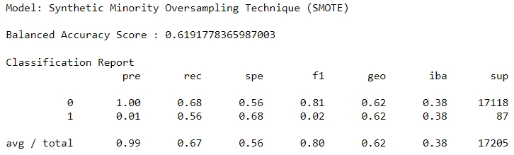

# Credit_Risk_Analysis

## Overview
Credit risk is an inherently unbalanced classification problem, as good loans easily outnumber risky loans. Therefore, you’ll need to employ different techniques to train and evaluate models with unbalanced classes. Jill asks you to use imbalanced-learn and scikit-learn libraries to build and evaluate models using resampling.

Using the credit card credit dataset from LendingClub, a peer-to-peer lending services company, you’ll oversample the data using the RandomOverSampler and SMOTE algorithms, and undersample the data using the ClusterCentroids algorithm. Then, you’ll use a combinatorial approach of over- and undersampling using the SMOTEENN algorithm. Next, you’ll compare two new machine learning models that reduce bias, BalancedRandomForestClassifier and EasyEnsembleClassifier, to predict credit risk. Once you’re done, you’ll evaluate the performance of these models and make a written recommendation on whether they should be used to predict credit risk.

## 6 Model Comparison Results

### Accuracy Scores
| MODEL | ACCURACY SCORE | HR PRECISION SCORE | HR RECALL SCORE | HR F1 SCORE | LR PRECISION SCORE | LR RECALL SCORE | LR F1 SCORE | TP (Predicted & Actual HR) | FN (Predicted LR, Actually HR) | FP (Predicted HR, Actually LR)| TN (Predicted & Actual LR) |
| ---: | --- | --- | --- | --- | --- | --- | --- | --- | --- | --- | --- |        
| Naive Random Oversampling| 59.0% | .01 | .64 | .01 | 1.0 | .54 | .70 | - | - | - | - |
| Synthetic Minority Oversampling Technique (SMOTE) | 61.9% | .01 | .56 | .02 | 1.0 | .68 | .81 | - | - | - | - |
| Undersampling | 56.5% | .01 | .56 | .01 | 1.0 | .57 | .72 | - | - | - | - |
| Combination (Over and Under) Sampling | 60.8% | .01 | .64 | .02 | 1.0 | .57 | .73 | - | - | - | - |
| Balanced Random Forest Classifier | 88.8% | .03 | .64 | .06 | 1.0 | .89 | .94 | 65 | 36 | 1,894 | 15,210 |
| Easy Ensemble AdaBoost Classifier | ***94.2%*** | ***.09*** | ***.92*** | ***.16*** | 1.0 | ***.94*** | ***.97*** | 93 | 8 | 985 | 16,119 |

## Winner!   Easy Ensemble AdaBoost Classifier

### Confusion Matrix
| Model Winner: Easy Ensemble AdaBoost Classifier | Predicted High Risk (HR,1) | Predicted Low Risk (LR,0) | total |
| ---: | :---: | :---: | :---: | 
| Actual High Risk (HR,1) | True Positive (TP) = 93 | False Negative (FN) = 8 | 101 |
| Actual Low Risk (LR,0) | False Positive (FP) = 985 | True Negative (TN) = 16,119 | 17104 |
|  total | 1,078 | 16,127 |  |

### Results 
The Easy Ensemble AdaBoost Classifier is the best of this bunch of models for predicting high-risk credit applications 
- Precision: the measure of how reliable a positive classification is. TP/(TP + FP).  
   - A low precision is indicative of a large number of false positives (ie. want this to be high)
   - low risk loans: 1.00
   - high risk loans: 0.09
- Recall: the ability of the classifier to find all the positive samples. TP/(TP + FN). 
   - A low recall is indicative of a large number of false negatives. (ie. want this to be high)
   - low risk loans: 0.94
   - high risk loans: 0.92
- F1 score: a weighted average of the true positive rate (recall) and precision (best score = 1.0, worst = 0.0)
   - low risk loans: 0.97 
   - high risk loans: 0.16
- Support: the number of actual occurrences of the class in the specified dataset.
   - low risk loan: 17,104 actual occurrences
   - high risk loans: 101 actual occurrences

## Summary 
Overall, the Ensemble would be suffecient in predicting high-risk credit applications because
1. the accuracy is the highest, coming in at 94.2% (good!),
2. the recall is high (good!),
3. there there is a low number of predicted low but actually high (these people will be your dafulters), or false negatives (good!),
4. and finally, although there's a slightly higher number of people who were predicted to high risk (false positives), but actually low risk, this group of people won't necessarily hurt the business, they just won't get chosen to participate in the lending. So in the end, being alittle on the high side is not harmful.

