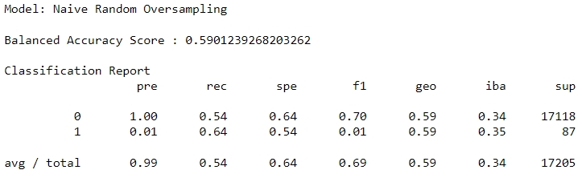
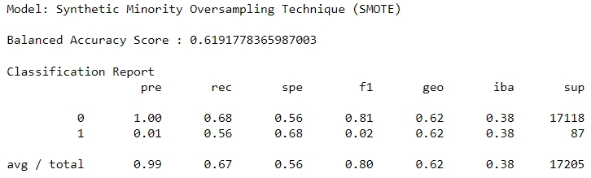
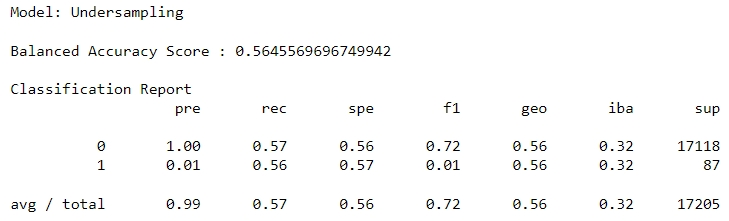
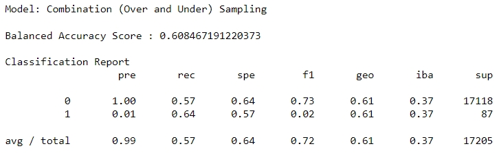
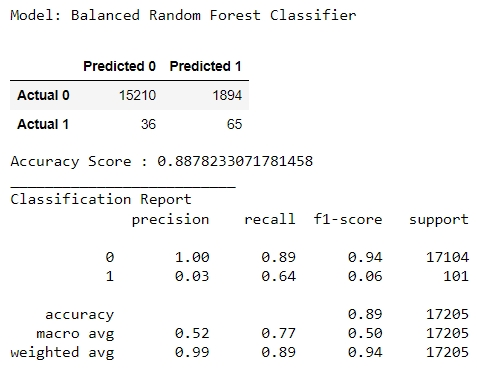
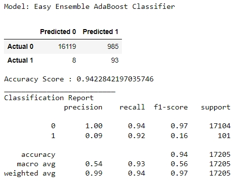

# Credit_Risk_Analysis

There is a title, and there are multiple sections (2 pt)
Each section has a heading and subheading (2 pt)
Links to images are working, and code is formatted and displayed correctly (2 pt).

Overview of the loan prediction risk analysis:
The purpose of this analysis is well defined (4 pt)

## Model Results:
There is a bulleted list that describes the balanced accuracy score and the precision and recall scores of all six machine learning models. Use screenshots of your outputs to support your results.(15 pt)

Support; 

|  | Predicted High Risk (HR,1) | Predicted Low Risk (LR,0) | Support |
| ---: | --- | --- | --- |
| Actual High Risk (HR,1) | True Positive (TP) | False Negative (FN) | 101 |
| Actual Low Risk (LR,0) | False Positive (FP) | True Negative (TN) | 17,104 |

| MODEL | ACCURACY SCORE | HR PRECISION SCORE | HR RECALL SCORE | HR F1 SCORE | LR PRECISION SCORE | LR RECALL SCORE | LR F1 SCORE | TP (Predicted & Actual HR) | FN (Predicted LR, Actually HR) | FP (Predicted HR, Actually LR)| TN (Predicted & Actual LR) |
| ---: | --- | --- | --- | --- | --- | --- | --- | --- | --- | --- | --- |        
| Naive Random Oversampling| 59.0% | .01 | .64 | .01 | 1.0 | .54 | .70 | TP | FN | FP | TN |
| Synthetic Minority Oversampling Technique (SMOTE) | 61.9% | .01 | .56 | .02 | 1.0 | .68 | .81 | TP | FN | FP | TN |
| Undersampling | 56.5% | .01 | .56 | .01 | 1.0 | .57 | .72 | TP | FN | FP | TN |
| Combination (Over and Under) Sampling | 60.8% | .01 | .64 | .02 | 1.0 | .57 | .73 | TP | FN | FP | TN |
| Balanced Random Forest Classifier | 88.8% | .03 | .64 | .06 | 1.0 | .89 | .94 | 65 | 36 | 1,894 | 15,210 |
| Easy Ensemble AdaBoost Classifier | 94.2% | .09 | .92 | .16 | 1.0 | .94 | .97 | 93 | 8 | 985 | 16,119 |

1. Naive Random Oversampling
 - 
 - 
2. Synthetic Minority Oversampling Technique (SMOTE)
 - 
 - 
3. Undersampling
 - 
 - 
4. Combination (Over and Under) Sampling
 - 
 - 
5. Balanced Random Forest Classifier
 - 
 - 
6. Easy Ensemble AdaBoost Classifier
 - 
 -

Summary:
There is a summary of the results (2 pt)
include a recommendation on the model to use, if any. If you do not recommend any of the models, justify your reasoning. (3 pt)‎
